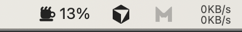
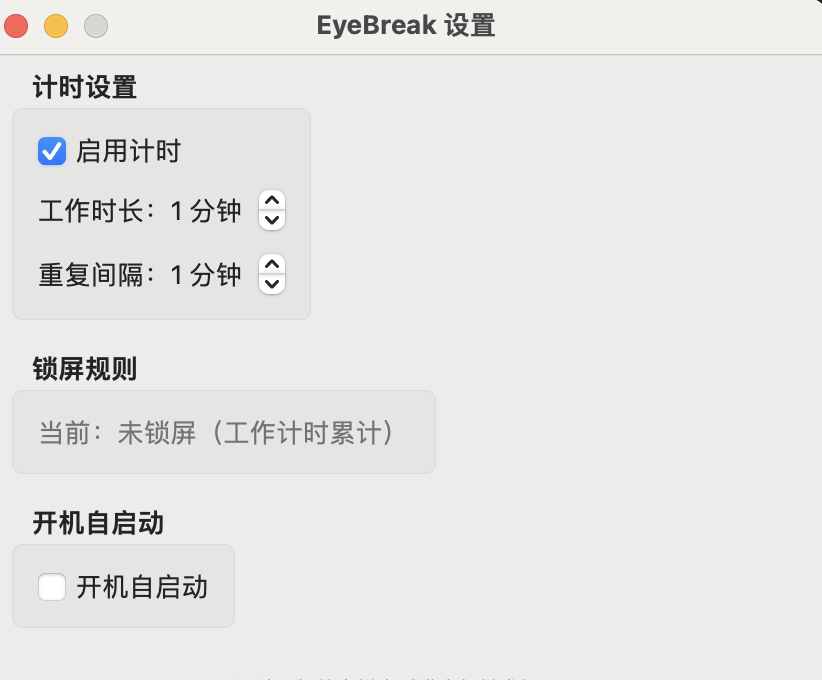

# EyeBreak

macOS 免费的菜单栏护眼/久坐提醒工具：根据「未锁屏」时间累计工作进度，到达目标后弹出全屏休息提醒；支持固定间隔重复提醒、锁屏清零、设置窗口、开机自启动。

## 功能

- **菜单栏显示进度**：顶部状态栏实时显示工作进度百分比。
- **锁屏清零**：进入锁屏即停止并清零；解锁后重新开始累计。
- **全屏休息提醒**：进度到 100% 立即弹出全屏遮罩提醒，可点击“继续工作”关闭。
- **重复提醒**：点击“继续工作”后，按用户设置的固定重复间隔再次提醒。
- **设置**：工作时长、重复间隔、启用开关、开机自启动。

## 截图 / 预览







## 构建与运行

本项目使用 Swift Package Manager（Swift 6）。

### 1) 构建可执行文件

```bash
swift build -c release
```

产物默认在：

- `.build/release/EyeBreak`

### 2) 组装 `.app`（推荐）

SwiftPM 默认只产出可执行文件；要得到 `EyeBreak.app`，可以用脚本把二进制打包成标准 app bundle：

```bash
bash Scripts/make_app.sh
```

产物在：

- `dist/EyeBreak.app`

### 3) 运行

直接运行可执行文件：

```bash
.build/release/EyeBreak
```

或运行 app bundle：

```bash
open dist/EyeBreak.app
```

## 常见问题

- **为什么 `swift build` 没有 `.app`**：SwiftPM 默认产物是可执行文件（例如 `.build/release/EyeBreak`），需要额外组装成 app bundle（见上面的 `Scripts/make_app.sh`）。
- **运行后不在 Dock 里**：这是菜单栏应用，代码里使用了 `NSApplication.ActivationPolicy.accessory`，并且 `Info.plist` 里设置了 `LSUIElement = true`。
- **为什么 Finder 里图标不是咖啡杯**：macOS 的 app 图标需要放在 bundle 的 `Contents/Resources/AppIcon.icns` 并在 `Info.plist` 里声明 `CFBundleIconFile`。`Scripts/make_app.sh` 会尽量把 `coffee.svg` 转成 `.icns`（优先 `rsvg-convert`/`inkscape`，否则尝试用系统的 `qlmanage` 预览渲染）。

## 项目结构

- `Sources/`：核心代码
  - `main.swift`：应用入口（菜单栏模式）
  - `EyeBreakAppDelegate.swift`：依赖装配与事件串联
  - `LockStateMonitor.swift`：锁屏/解锁检测
  - `WorkSessionManager.swift`：工作计时与进度
  - `ReminderScheduler.swift`：提醒调度（固定重复间隔）
  - `ReminderWindowController.swift`：全屏提醒面板
  - `StatusBarController.swift`：状态栏图标/菜单
  - `SettingsView.swift` / `SettingsWindowController.swift`：设置 UI
  - `Preferences.swift`：UserDefaults 持久化

## 使用说明

- **工作时长**：达到该时长后会触发全屏提醒。
- **重复间隔**：点击“继续工作”后，等待该间隔再次提醒。
- **启用计时**：关闭会停止并重置计时。
- **开机自启动**：macOS 13+ 使用 `SMAppService` 尝试注册（需要以 app bundle 形式运行时更稳定）。

